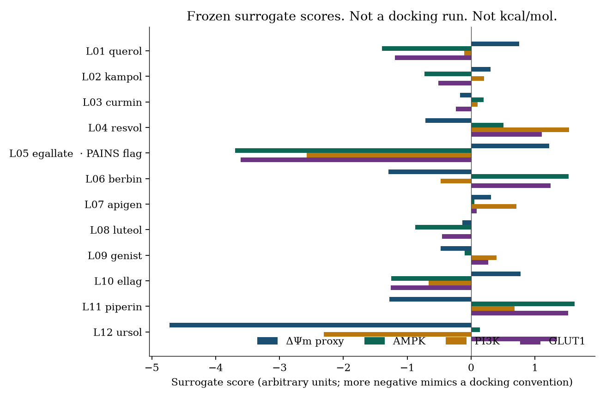
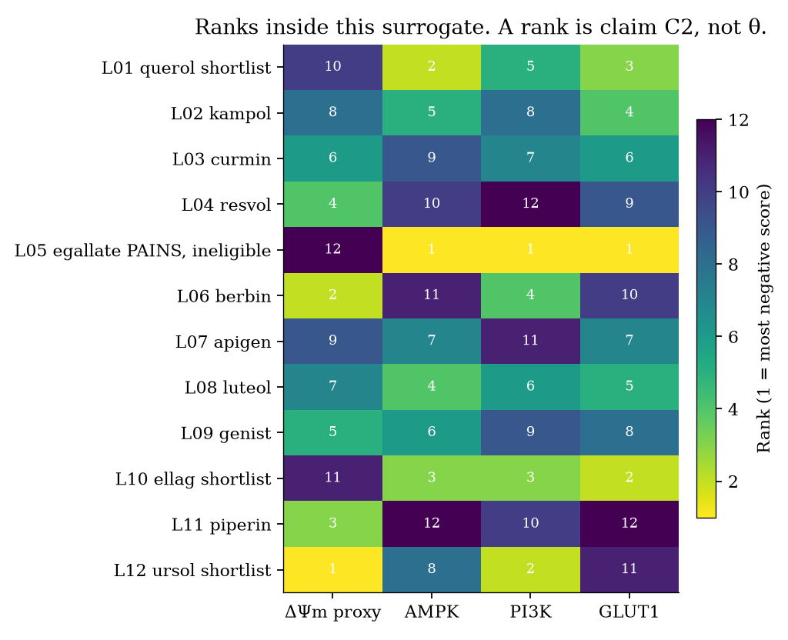
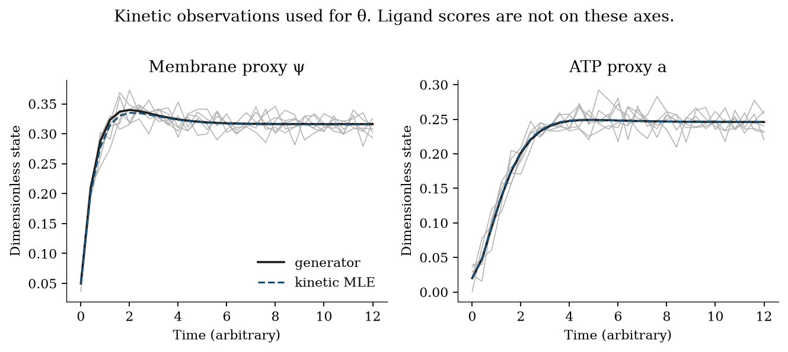
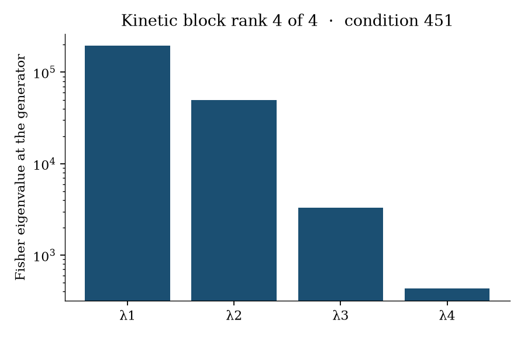
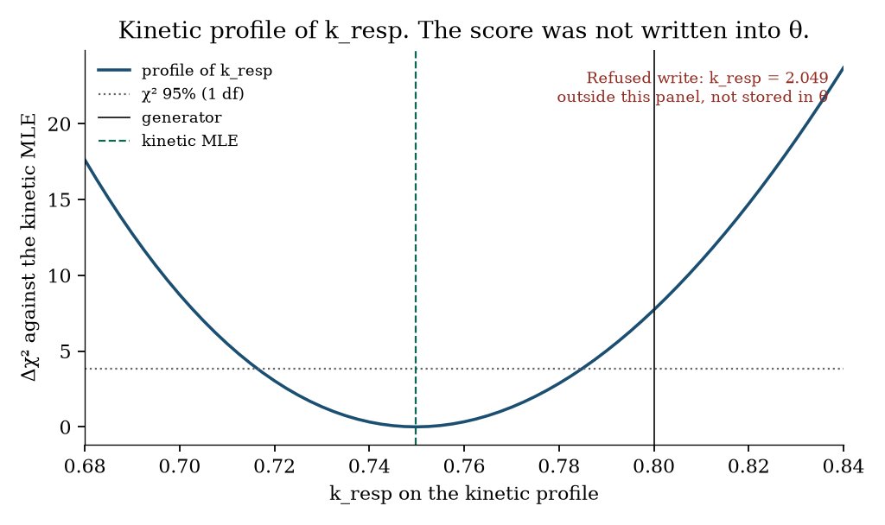

# In-silico prioritisation of phytochemical effects on mitochondrial membrane potential and metabolic-regulator binding under claim–evidence gates

**Thesis #16. Computational research thesis** (series label R5)  
**Author:** Kelechi Emeka Ogbonna  
**Correspondence:** kelechiogbonna300@gmail.com · https://github.com/cloudynirvana/thesis-16-mitochondrial-dpsim-phytochemical-screen  
**Date:** 21 September 2026  
**Format:** B.Sc. project chapters (Nile University style), written as a computational methods manuscript  
**Status:** In-silico screen of a frozen toy library. Surrogate scores. Not a docking campaign. Not a clinical result.  
**Citation style:** numbered Vancouver. A `doi:` field appears only where Crossref returned the record.  
**DOI:** none for this document. Do not invent one.

---

## Title page

**IN-SILICO PRIORITISATION OF PHYTOCHEMICAL EFFECTS ON MITOCHONDRIAL MEMBRANE POTENTIAL AND METABOLIC-REGULATOR BINDING UNDER CLAIM–EVIDENCE GATES**

BY

**KELECHI EMEKA OGBONNA**

A COMPUTATIONAL RESEARCH THESIS  
(IN-SILICO SCREENING STUDY)

SUBMITTED AS A CITEABLE MANUSCRIPT FOR JOURNAL / THESIS HANDOFF

PROJECT CONFLUENCE  
INDEPENDENT COMPUTATIONAL RESEARCH

SUPERVISOR: not appointed for this deposit

SEPTEMBER 2026

---

## Declaration

I, Kelechi Emeka Ogbonna, declare that this computational research thesis was carried out by me. The ranks, refusals, Fisher spectrum and profile reported here were produced by `sim/screen.py` at seed 20260921. They are not wet-lab measurements, not docking poses, and not patient outcomes. No DOI, ORCID or journal acceptance was invented for this document.

_________________________     _______________________  
Kelechi Emeka Ogbonna         Date

---

## Abstract

Mitochondrial-reprogramming roadmaps prioritise simulating ΔΨm and AMPK/PI3K/GLUT1 binding, but docking scores and tip-shift anecdotes are easily smuggled into kinetic Θ. How can a frozen plant-ligand library be screened so scores remain gated evidence and never become identified parameters?

Twelve toy rows were hashed and passed through a frozen linear surrogate on four columns: a dimensionless membrane-potential proxy, AMPK, PI3K and GLUT1. AutoDock Vina, Glide, GOLD and RDKit were not run. Rank 1 is the most negative number on that column. A row reaches claim C3, which nominates a future observation channel, only when its frozen PAINS flag is clear and it lies in the top quartile on at least two columns. Claim C4, an identified kinetic parameter, is named in the code and is never written.

Row L05 carries the PAINS flag and wins the AMPK, PI3K and GLUT1 columns, with scores −3.698, −2.574 and −3.605. It stays at claim C2. The priority list is L10, L01, then L12. Three promotions were attempted and refused: the AMPK score of L05 into kresp, the membrane score of L12 into kleak, and a roadmap sentence about Gtip moving from 0.238 to 0.245 into a name that is outside θ. The SHA-256 of θ was `0b85bb8afb97637e5d4e880ec2dd2fdfc8673be14ff6fd499208c31bae50ef6b` before those calls and after them.

A separate kinetic schedule, six noisy replicates of the membrane proxy and an ATP proxy, gives Fisher rank 4 of 4 for the four rates. The profiled 95% interval for kresp on this seed is 0.716 to 0.785. The generating value 0.80 sits outside that interval. The value 2.049, which a forbidden map would have written from the AMPK score, also sits outside it, and was not stored. The derivative of the kinetic objective with respect to the score is zero. The tip shift was not recomputed. Research only.

---

## Keywords

mitochondrial membrane potential; AMPK; PI3K; GLUT1; phytochemical library; surrogate score; docking caveat; claim–evidence gate; parameter identifiability; profile likelihood; ordinary differential equations; research only

---

## Table of Contents

DECLARATION  
ABSTRACT  
Table of Contents  
List of tables and figures  

CHAPTER ONE. INTRODUCTION  
1.1 Background to the study  
1.2 STATEMENT OF RESEARCH PROBLEM  
1.3 JUSTIFICATION OF STUDY  
1.4 AIM AND OBJECTIVES OF THE STUDY  
1.5 SIGNIFICANCE OF THE STUDY  
1.6 SCOPE OF THE STUDY  

CHAPTER TWO. LITERATURE REVIEW  
2.1 Membrane potential is a measurement  
2.2 AMPK, PI3K and GLUT1  
2.3 What docking assessments already limit  
2.4 Libraries, interference flags, and claim language  
2.5 Kinetic θ and the likelihood that can identify it  
2.6 Where this thesis sits beside theses 01, 07 and 08  

CHAPTER THREE. MATERIALS AND METHODS  
3.1 Design  
3.2 Frozen library  
3.3 Surrogate score  
3.4 Gates and the claim ceiling  
3.5 Kinetic model  
3.6 Profile, derivative, and the contrast map  
3.7 What was not done  

CHAPTER FOUR. RESULTS  
4.1 Scores on the pinned library  
4.2 Ranks, utility, and the shortlist  
4.3 Three refusals  
4.4 Kinetic θ on its own schedule  
4.5 A contrast that stays out of the ledger  

CHAPTER FIVE. DISCUSSION, CONCLUSION AND RECOMMENDATION  
5.1 Discussion  
5.2 Conclusion  
5.3 Recommendation  

REFERENCES  
DISCLAIMER  

---

## List of tables and figures

**Table 3-1.** Frozen toy library.  
**Table 3-2.** Frozen surrogate weights.  
**Table 3-3.** Gates.  
**Table 3-4.** Kinetic schedule.  
**Table 4-1.** Surrogate scores.  
**Table 4-2.** Ranks, utility and claim level.  
**Table 4-3.** Refusals.  
**Table 4-4.** Generating values, kinetic maximum likelihood, and local standard-error sketches.  

**Figure 4-1.** Surrogate scores by row and column.  
**Figure 4-2.** Rank matrix.  
**Figure 4-3.** Kinetic trajectories used to estimate θ.  
**Figure 4-4.** Fisher spectrum of the kinetic block at the generator.  
**Figure 4-5.** Profile of kresp.

Figures are diagnostics from seed 20260921. They are not measured membrane potentials and not docking poses.

---

# CHAPTER ONE

## 1.0 INTRODUCTION

### 1.1 Background to the study

Cancer metabolism is a reason to keep model objects apart. It is not a source of rate constants. The later hallmarks include a reprogramming of cellular energetics [1]. Warburg had already described aerobic glycolysis in tumour slices [2]. Vander Heiden, Cantley and Thompson restated that description as a biosynthetic requirement of proliferation [3]. Pavlova and Thompson treated the recurring metabolic features of cancer as a shared set across tumour types [4]. Mitochondria sit inside that set. They are not a single switch that a ligand turns [5–7].

Roadmaps that start from this literature often add two further ambitions. One is a simulation of mitochondrial membrane potential, ΔΨm. The other is a statement about phytochemical binding at AMPK, PI3K or GLUT1. Those ambitions meet objects that already have their own methods. Membrane potential is a physical difference across the inner membrane, and the fluorescent probes used to report it have a practical literature of their own [8,9]. AMPK is a nutrient and energy sensor [10]. PI3K names a pathway with more than one isoform [11]. GLUT1 is a glucose transporter whose crystal structure is published [12]. A bioenergetic ordinary differential equation can be written at a much finer grain than anything in this repository [13]. None of those papers authorises a docking score to enter a kinetic parameter vector.

Docking is a ranking device. Kitchen and colleagues describe it as pose generation followed by a score [14]. Chen’s review collects the ways a score gets treated as if it were an affinity [15]. The present work takes that warning as a design constraint. The numbers in Chapter Four come from a linear function of frozen descriptors. The function is a surrogate, standing where a docking score would have stood. The engine that would have produced a pose was not run.

The neighbouring theses fix the boundary this one has to keep. Thesis #1 keeps oncology knowledge out of the parameter vector θ [16]. Thesis #7 asks which rates of a frozen three-state ATP–ROS–glucose model remain identifiable when phytochemical and nanocarrier symbols are known forcings [17]. Thesis #8 reads an undergraduate *Carica papaya* silver-nanoparticle α-amylase assay as a named observation channel [18]. The 2022 Nile University wet-lab thesis is that assay’s home, and it is a different document [19]. This manuscript does not refit the tip ODE, does not re-tabulate the α-amylase numbers, and does not place a ligand inside a differential equation.

### 1.2 STATEMENT OF RESEARCH PROBLEM

Mitochondrial-reprogramming roadmaps prioritise simulating ΔΨm and AMPK/PI3K/GLUT1 binding, but docking scores and tip-shift anecdotes are easily smuggled into kinetic Θ. How can a frozen plant-ligand library be screened so scores remain gated evidence and never become identified parameters?

The working form of that question is small. Twelve rows are frozen and hashed. Four columns receive a surrogate score. A claim ladder stops at a nomination for a future observation channel. A four-rate linear model is estimated from synthetic traces of a membrane proxy and an ATP proxy. The demonstration required of the screen is a refusal: a call that would copy a score into θ returns refused, and the hash of θ does not change.

Θ in the sentence above is the kinetic parameter vector. From here it is written θ. It contains kresp, kleak, katp and kuse. It does not contain a score, a rank, a utility, or the roadmap pair 0.238 and 0.245.

A familiar way to miss the question is to sort the library, take the most negative AMPK number, and multiply a respiratory rate by it. Another is to treat a printed tip shift as if it had been estimated in the same likelihood as the rates. A third is to let a large score overrule an interference flag. Chapter Three writes a gate for each of those moves. Chapter Four records what the gates did on this library.

### 1.3 JUSTIFICATION OF STUDY

Warren and colleagues compared docking programs and scoring functions on the same ligands and found disagreements large enough to block any quiet identification of the score with a binding free energy [20]. A rank inside one declared function can still be computed and stored [14]. Storage is a different act from identification [21]. The study is justified by that difference, applied to a library small enough that every row can be shown.

The tip-shift anecdote is the second route into θ. An unpublished roadmap has been described, including in Thesis #7, as mentioning Gtip moving from about 0.238 to about 0.245 [17]. Thesis #7 treats the pair as motivation and does not report it as an identifiability result. This thesis does the same, with one added mechanical step: the sentence is stored as an anecdote object, and a function that would promote it into a parameter name returns refused. The pair is not an input to the differential equation, and it is not recomputed.

Saltelli and colleagues ask that a model expose the assumptions a number depends on [22]. May’s warning, aimed at biology that borrows equations faster than it audits them, is the same demand [23]. A surrogate weight vector is an assumption of that kind. It is printed in Section 3.3 so that a later reader can see which descriptor the membrane column rewards.

The study is not justified as a device, a dosing rule, or a claim that any toy row restores oxidative phosphorylation [22,23].

### 1.4 AIM AND OBJECTIVES OF THE STUDY

The aim is to screen a frozen toy library under an explicit claim ceiling, and to show that a surrogate score remains an evidence record while θ is estimated, if it is estimated at all, from a kinetic schedule that does not read the score.

The objectives are:

1. Freeze twelve ligand-like rows, write them to a canonical JSON document, and pin the SHA-256.
2. Score four columns with a declared linear surrogate, and label the engine field empty.
3. Rank each column, compute a utility, and assign claims so that C3 requires a clear PAINS flag and a top-quartile rank on at least two columns.
4. Call the promotion function on the AMPK-column winner, on the membrane score of a shortlisted row, and on the roadmap anecdote. Record the status and the hash of θ.
5. Estimate the four kinetic rates from noisy traces, report the Fisher rank at the generator, and profile kresp.
6. Evaluate a forbidden map from the AMPK score onto kresp only as a contrast, stored outside the ledger.

Non-aims. Running a docking program. Fitting Beard’s respiratory model, or any other published bioenergetic ODE. Recomputing Gtip. Reading the 2022 α-amylase table as a channel in this likelihood. Translating a rank into a dose.

### 1.5 SIGNIFICANCE OF THE STUDY

The useful product is a ledger in which a priority list and a parameter estimate are different fields. A shortlist can be cited. A Fisher rank can be cited. The screen gives no rule for multiplying them. That separation is local to the functions in `sim/screen.py`. It is still the sort of fact a later worker can check without accepting a clinical sentence [22].

There is a second product inside the shortlist rule. Utility alone does not nominate a row. A row with a high mean rank and a PAINS flag remains visible in the score table and stays off the priority list. Hiding the row would have made the gate look stricter than it is. Showing the row, and refusing it, is the result.

What the significance is not: a change in membrane potential, a binding constant, or a reason to treat a cell [5,22].

### 1.6 SCOPE OF THE STUDY

In scope. Twelve mnemonic rows. Four surrogate columns. Gates G0 to G4. A linear three-state teaching model with two observed channels and one hidden redox state. Gaussian noise at a declared σ. One seed. One profiled coordinate. One contrast map, labelled as a contrast.

Out of scope. Receptor structures, prepared ligands, and any pose. A measured ΔΨm in millivolts. Isoform choice inside PI3K. A PAINS filter computed from a chemical graph; the flag here is a frozen bit. The TNBC tip ODE of Thesis #7. The papaya assay of Thesis #8. Patient series, doses, and regulatory use.

---

# CHAPTER TWO

## 2.0 LITERATURE REVIEW

### 2.1 Membrane potential is a measurement

ΔΨm is the electrical part of the protonmotive force across the inner mitochondrial membrane. Proton pumping builds it. ATP synthesis and proton leak spend it [8,24]. Reviews aimed at experimentalists emphasise that the number one reports depends on the probe, the quench, the plasma-membrane contribution, and the calibration [8,9,24]. Brand and Nicholls set out how easy it is to call a dye trace a dysfunction when the trace has not been tied to a flux [24].

Quantitative work uses cationic dyes that redistribute with the potential. Gerencser and colleagues calibrate that redistribution in cultured cells and show both depolarisation and hyperpolarisation as experimental outcomes, not as docking outputs [25]. Ehrenberg and colleagues state the Nernstian basis: the dye is a cation, and the concentration ratio reports the potential when the assumptions hold [26]. Rhodamine derivatives are in that family, with their own loading artefacts [27]. JC-1 adds a further optical step, J-aggregate formation, which is a concentration-dependent spectral change [28]. Nicholls has argued for years that the probe reading and the biological claim have to be kept in separate sentences [29].

A phytochemical score does not satisfy those assumptions. The surrogate defined in Section 3.3 puts its largest negative membrane weight on logP. The column therefore behaves like a lipophilicity rank. Lipophilicity of a neutral toy row is not the Nernst distribution of a cationic probe [26]. The weight is printed so that this bias is visible.

### 2.2 AMPK, PI3K and GLUT1

AMPK responds to cellular energy charge [10]. Herzig and Shaw review its connection to mitochondrial homeostasis [30]. The structural literature is specific about what “binding” means for this enzyme: Xiao and colleagues report the basis of AMP binding at the regulatory sites [31]. That structure is a crystallographic result. A scalar next to the word AMPK in a screening table is a different object. Hawley and colleagues show that salicylate can activate AMPK by a direct biochemical route [32]. The paper is about an activation experiment. It is not imported here as a coefficient.

Phytochemical papers sometimes occupy the same vocabulary. Lee and colleagues reported AMPK activation by berberine in diabetic and insulin-resistant models [33]. The report belongs to that paper. This repository does not reanalyse it. The toy label `berbin` is a mnemonic for an alkaloid-like row. The row was not parameterised from the Diabetes study, and its score is not written into kresp.

PI3K is a family. Fruman and colleagues review the pathway in human disease [11]. Thorpe, Yuzugullu and Zhao stress that isoforms, modes of activation, and therapeutic hypotheses come apart [34]. Vanhaesebroeck, Stephens and Hawkins reconstruct the path by which the pathway was even named [35]. A column headed `pi3k` in a twelve-row toy cannot choose an isoform. The column is a label on a linear score.

GLUT1 has a structure [12]. Mueckler and Thorens place it in the SLC2 family, with distinct transport roles across tissues [36]. Ancey, Contat and Meylan trace how transporter biology in cancer is then asked to carry a microenvironment story as well [37]. A surrogate number does not become a Vmax. The kinetic model in Section 3.5 has no glucose transporter parameter at all.

### 2.3 What docking assessments already limit

The methodological reviews agree on a limit even when they disagree on the remedy. A docking campaign proposes poses and ranks them with a scoring function [14]. Warren and colleagues’ critical assessment found that programs and functions which look interchangeable on a methods slide do not return interchangeable ligand orders [20]. Chen lists practices, including over-interpretation of a single score, that inflate confidence [15]. Pantsar and Poso put the fiction at a precise step: the step that reads a score as a binding affinity [38].

Irwin and Shoichet describe screens that have started real biological follow-up [39]. Follow-up is a later experiment. It is not a rewriting of the score as a rate. Bender and colleagues list what a large-scale docking effort actually consumes: prepared structures, protomer and tautomer choices, and decoy controls [40]. This repository has none of those inputs. Trott and Olson document AutoDock Vina, including the empirical scoring function and the search [41]. Vina was not installed in the environment that produced Chapter Four, and it was not called. Glide, GOLD and RDKit were not called either. The empty engine field in the evidence record is that fact, stored where a pose id would have been stored.

### 2.4 Libraries, interference flags, and claim language

Natural-product collections carry two extra difficulties. Many members are promiscuous in assays for reasons that have nothing to do with the target one hoped to study. Baell and Holloway published substructure filters, PAINS, for that problem [42]. Baell and Walters later described how such compounds continue to consume follow-up [43]. The `pains` field in Table 3-1 is not the output of those filters. No chemical graph was parsed. The field is a frozen bit on one row, so that the gate can be seen to refuse a column winner. A reader who treats the bit as a computed PAINS call will be reading past Section 3.2.

Atanasov and colleagues review what natural-product discovery still requires once a list exists: chemistry, provenance, and assays that survive controls [44]. Harvey, Edrada-Ebel and Quinn make the related point from the genomics era: a renewed interest in natural products does not replace isolation and characterisation [45]. A utility sort is neither of those activities.

Claim language has its own drift. Baur and Sinclair gathered animal and human reports on resveratrol under a therapeutic heading [46]. The ledger in Chapter Three has no slot for that heading. The highest written claim is C3, a nomination that a future observation channel could be designed. The nomination does not name a disease and does not name a dose.

### 2.5 Kinetic θ and the likelihood that can identify it

Structural identifiability asks whether the input–output map determines the parameter when noise is set aside [47]. Practical identifiability asks whether the confidence set for a coordinate stays bounded once noise, a finite sample, and nuisance parameters are admitted [21]. The profile likelihood is the tool Raue and colleagues use for that second question, and Kreutz and colleagues discuss it as a way to separate a flat structural direction from a shallow statistical one [21,48]. A profile answers the question only for the likelihood that was written down. If that likelihood does not read a score, the profile has nothing to say about the score.

Sloppiness is a statement about the spread of eigenvalues, not about a single zero [49]. The condition number in Chapter Four is finite and moderate beside the spectra Gutenkunst and colleagues reported. It is still reported, because a full rank with a condition in the hundreds is a different sentence from “every coordinate is equally pinned” [49,50].

Published mitochondrial models already occupy the ground a roadmap might want to simulate. Beard’s model of respiration and oxidative phosphorylation is a biophysical object with its own parameters [13]. Cortassa and colleagues couple mitochondrial energetics to calcium in a cardiac model [51]. Neither model is integrated here. The three-state linear system in Section 3.5 is a teaching reduction, chosen so that a kinetic θ exists and can be shown to ignore the library. Altrock, Liu and Michor describe how readily mathematical oncology moves from a pathway story to a simulation [52]. The order in this thesis is the reverse for the ligand: the score is computed, and the differential equation never receives it.

Munafò and colleagues argue that a result which cannot be rerun from its materials has a weaker claim than one which can [53]. The materials here are the script, the seed, and the pinned hash.

### 2.6 Where this thesis sits beside theses 01, 07 and 08

Thesis #1 is the general refusal: knowledge does not become θ by being written next to a model [16]. The knowledge in the present work is a score table. The refusal is implemented as a function with a single status.

Thesis #7 freezes a tipping-point ODE and treats phytochemical symbols as known forcings, then asks which kinetic coordinates the ATP, ROS and glucose schedules can see [17]. A forcing, in that design, is a number the investigator sets. It is not a pose score, and it is not evidence of efficacy. The present design does not put the ligand in the vector field at all. Copying a score into kresp or kleak would be the act Gate G3 refuses. The roadmap pair Gtip 0.238 to 0.245 is motivation in Thesis #7 and motivation here. It is not a result of either calculation.

Thesis #8 takes a wet-lab α-amylase assay and gives it the status of an observation channel, with the assay kept out of θ as a treatment parameter [18]. Claim C3 below only records that a future channel could be designed. No absorbance, no percent inhibition, and no nanoparticle batch from the 2022 thesis enters the likelihood [19].

---

# CHAPTER THREE

## 3.0 MATERIALS AND METHODS

### 3.1 Design

The library, the weights, the noise and the replicates are synthetic. No herbarium extract, no ZINC download, and no cell-line file enters the calculation.

The generator is fixed. Seed 20260921. Twelve rows. Four score columns. Six kinetic replicates. Software is `sim/screen.py`. The library SHA-256 pinned in that file is `46d685fbeccf5b7b8facf06623c6d46f34f7aa1c91fc3bed2fec0cd0fcc68a16`. The SHA-256 of the library together with the weights and the standardization constants is `45bac582935b902f4e3d5bbe85bfaf48bb9b071abcd25f7ef681a96b62bc53c0`. A one-line edit of the first row’s logP changes the library hash, and the scoring function then raises. That check is part of the run, not a separate essay.

### 3.2 Frozen library

A plant-ligand library, in the sense of this thesis, is a frozen table of ligand-like rows. The rows are toys. Labels are mnemonic (`querol`, `egallate`, `ursol`, and the rest). They are not a statement that the natural product suggested by the mnemonic was purchased, docked, or assayed. Descriptors are the constants in Table 3-1. They were not fitted.

The PAINS column is a frozen bit. It is 1 for L05 and 0 for every other row. Section 2.4 says what that bit is not.

**Table 3-1.** Frozen toy library. Descriptors are declared constants.

| ID | Label | Scaffold | MW | logP | TPSA | HBD | HBA | Rings | PAINS |
| --- | --- | --- | ---: | ---: | ---: | ---: | ---: | ---: | ---: |
| L01 | querol | flavonol | 302 | 1.5 | 131 | 5 | 7 | 3 | 0 |
| L02 | kampol | flavonol | 286 | 1.9 | 111 | 4 | 6 | 3 | 0 |
| L03 | curmin | diarylheptanoid | 368 | 3.2 | 93 | 2 | 6 | 2 | 0 |
| L04 | resvol | stilbene | 228 | 3.1 | 60 | 3 | 3 | 2 | 0 |
| L05 | egallate | flavan | 458 | 1.2 | 197 | 8 | 11 | 4 | 1 |
| L06 | berbin | alkaloid | 336 | 2.6 | 41 | 0 | 5 | 5 | 0 |
| L07 | apigen | flavone | 270 | 1.7 | 91 | 3 | 5 | 3 | 0 |
| L08 | luteol | flavone | 286 | 2.5 | 112 | 4 | 6 | 3 | 0 |
| L09 | genist | isoflavone | 270 | 2.7 | 87 | 3 | 5 | 3 | 0 |
| L10 | ellag | polyphenol | 302 | 1.1 | 134 | 4 | 8 | 4 | 0 |
| L11 | piperin | amide | 285 | 3.5 | 39 | 0 | 4 | 3 | 0 |
| L12 | ursol | triterpene | 457 | 7.3 | 58 | 2 | 3 | 5 | 0 |

Canonical bytes are JSON with sorted keys and no insignificant whitespace, hashed with SHA-256. The same bytes are written to `sim/library.json` on each successful run.

### 3.3 Surrogate score

Descriptors are standardized with declared centers and scales, not with the sample mean of these twelve rows. A thirteenth row would not refit the scale. Centers are MW 350, logP 2.5, TPSA 90, HBD 3, HBA 5, rings 3. Scales are 80, 1.2, 40, 2, 2 and 1.

For target t and descriptor j,

zj = (xj − cj) / sj

St = bt + Σj wt,j zj

The sign convention borrows the direction of an empirical docking score: more negative is the direction the ranker treats as stronger. The unit is arbitrary. It is not kcal/mol, not kJ/mol, and not a free energy. Weights are Table 3-2.

**Table 3-2.** Frozen surrogate weights. Bias is bt.

| Target | logP | TPSA | MW | HBD | HBA | Rings | Bias |
| --- | ---: | ---: | ---: | ---: | ---: | ---: | ---: |
| Membrane proxy | −0.90 | 0.35 | 0.10 | −0.15 | 0.05 | −0.40 | −0.20 |
| AMPK | −0.25 | −0.55 | 0.15 | −0.70 | −0.30 | −0.10 | 0.05 |
| PI3K | −0.40 | −0.20 | −0.35 | −0.10 | −0.45 | −0.50 | 0.10 |
| GLUT1 | 0.15 | −0.60 | −0.25 | −0.20 | −0.35 | 0.10 | −0.05 |

The membrane column’s largest negative coefficient is on logP. The AMPK column’s largest negative coefficient is on the hydrogen-bond donor count. L05 has the largest donor count in the table and carries the PAINS flag. Those two frozen choices are why a column win for L05 is available for the gate to refuse. The weights were not estimated from an assay, and they are not an AMPK pharmacophore.

Rank 1 on a column is the most negative score. Ties would break by row id; this library has none. Utility is the mean, across the four columns, of (13 − rank) / 12. Utility orders rows. It does not assign the claim.

### 3.4 Gates and the claim ceiling

Evidence and θ live in different fields of a ledger. The kinetic vector is initialised from the kinetic maximum likelihood in Section 3.5. Promotion appends a refusal record and returns the string `refused`. There is no branch that writes.

**Table 3-3.** Gates implemented in `sim/screen.py`.

| Gate | What it checks | What a failure does |
| --- | --- | --- |
| G0 | Library SHA-256 equals the pin | Scoring raises, and no rank is issued |
| G1 | A score record has engine null, unit `arbitrary_surrogate`, and `may_enter_theta` false | A record that asks to enter θ raises |
| G2 | Claim level is at most 3 | Level 4 raises and is never assigned |
| G3 | `promote_score_to_theta` | Always returns refused; θ hash unchanged |
| G4 | `promote_anecdote_to_theta` | Always returns refused; the anecdote stays text |

Claims, in words:

- C0, the row is frozen.
- C1, a surrogate score is recorded.
- C2, the row has ranks inside this surrogate.
- C3, nominate a future observation channel.
- C4, identified kinetic parameter. Unreachable.

C3 requires `pains = 0` and rank ≤ 3 on at least two of the four columns. Rank ≤ 3 is the top quartile of twelve. Rows that fail the rule remain in the score table at C2 if they were ranked. The priority list is the C3 rows sorted by descending utility, then by id.

The anecdote object stores this text and nothing else: an unpublished mitochondrial-reprogramming roadmap mentioned Gtip moving from 0.238 to 0.245. The object sets `recomputed_here` to false and `may_enter_theta` to false. Gate G4 is called with the parameter name `g_tip`, which is not among the four names in θ.

### 3.5 Kinetic model

States are a dimensionless membrane proxy ψ, an ATP proxy a, and a hidden redox proxy r. The vector field is linear:

dψ/dt = kresp r − kleak ψ

da/dt = katp ψ − kuse a

dr/dt = kfeed − (kdrain + kresp) r

θ = (kresp, kleak, katp, kuse). The feed and drain are known constants, not estimates. Generating values and the observation schedule are Table 3-4. Initial state (ψ, a, r) = (0.05, 0.02, 0.75). Integration uses LSODA. The likelihood sees ψ and a only.

**Table 3-4.** Kinetic schedule. Time is in arbitrary units. Noise is Gaussian on the two observed channels.

| Quantity | Value |
| --- | --- |
| kresp, kleak, katp, kuse | 0.80, 1.10, 0.70, 0.90 |
| kfeed, kdrain | 0.50, 0.35 |
| Times | 0 to 12, 31 points |
| Replicates | 6 |
| σ | 0.015 |
| Seed | 20260921 |
| Optimiser starts | (1.30, 0.60, 1.10, 0.50), (0.40, 1.80, 0.30, 1.40), (0.95, 0.85, 0.55, 1.20) |

The fit minimises the sum of squared residuals after division by σ, with each coordinate bounded to (0.05, 4). The best of the three starts is kept. Residuals at that point supply a numerical Fisher matrix. A second Fisher matrix is the expected information of the mean map at the generator, multiplied by the replicate count, with central differences of relative step 10−5. Ranks use two cuts: a singular value above 10−8 times the largest, and a practical cut at 10−3 times the largest. Local standard-error sketches are the square roots of the diagonal of the inverse expected information, divided by the generating value.

No term in the residual vector reads a score. The derivative of the kinetic objective with respect to a score is therefore an identity, and the script checks that the central difference is 0.

### 3.6 Profile, derivative, and the contrast map

The profile fixes kresp on 65 evenly spaced nodes from 0.68 to 0.84 and refits the other three rates. Delta chi-square is the rise in residual sum of squares above the unconstrained minimum. The 95% threshold for one degree of freedom is 3.841. The reported ends of the interval are linear interpolations of the crossings on that scan [21,48].

A contrast function, named `forbidden_smuggle_for_contrast`, maps the AMPK-column score S onto a replacement for kresp:

kresp = 0.20 + 0.50 (−S)

The ledger does not call this function. The main program calls it after the refusals, stores the image under the key `contrast_not_a_result`, and checks that the ledger hash is still the pre-refusal hash. The image is a demonstration of the size of the write the gate exists to stop. It is not an estimate of a respiratory rate.

### 3.7 What was not done

No receptor and no ligand coordinate file were read. Vina, Glide, GOLD and RDKit did not run [40,41]. The PAINS bit was not computed from a SMARTS pattern [42]. Beard’s model and the Cortassa cardiac model were not integrated [13,51]. Gtip was not simulated [17]. The α-amylase numbers of the 2022 thesis were not loaded [19]. A global structural-identifiability certificate was not computed [47,50]. The profile grid is finite, and the interval quoted from it is an interpolation on that grid [21].

---

# CHAPTER FOUR

## 4.0 RESULTS

### 4.1 Scores on the pinned library

The run that wrote `sim/results.json` used the pinned library hash in Section 3.1. Table 4-1 gives the four scores to three decimals. Figure 4-1 shows the same numbers as bars. Negative bars point left, which is the direction the ranker treats as stronger.

**Table 4-1.** Surrogate scores in arbitrary units. More negative ranks higher. These are not docking scores.

| ID | Label | PAINS | Membrane | AMPK | PI3K | GLUT1 |
| --- | --- | ---: | ---: | ---: | ---: | ---: |
| L01 | querol | 0 | 0.749 | −1.395 | −0.112 | −1.190 |
| L02 | kampol | 0 | 0.304 | −0.734 | 0.200 | −0.515 |
| L03 | curmin | 0 | −0.176 | 0.197 | 0.098 | −0.239 |
| L04 | resvol | 0 | −0.715 | 0.509 | 1.534 | 1.106 |
| L05 | egallate | 1 | 1.221 | −3.698 | −2.574 | −3.605 |
| L06 | berbin | 0 | −1.296 | 1.527 | −0.477 | 1.241 |
| L07 | apigen | 0 | 0.309 | 0.053 | 0.712 | 0.085 |
| L08 | luteol | 0 | −0.138 | −0.873 | −0.005 | −0.455 |
| L09 | genist | 0 | −0.476 | −0.100 | 0.398 | 0.270 |
| L10 | ellag | 0 | 0.775 | −1.253 | −0.668 | −1.260 |
| L11 | piperin | 0 | −1.277 | 1.621 | 0.681 | 1.518 |
| L12 | ursol | 0 | −4.721 | 0.141 | −2.308 | 1.346 |

L12 has the most negative membrane score, −4.721. L05 has the most negative AMPK score, −3.698, the most negative PI3K score, −2.574, and the most negative GLUT1 score, −3.605. L05 is also the only row with the PAINS flag, and its membrane score is the most positive in the library, +1.221. The membrane column and the three regulator columns do not share a winner.

**Figure 4-1.** Frozen surrogate scores. The horizontal axis is in arbitrary units. The engine field on every record is empty.

### 4.2 Ranks, utility, and the shortlist

Table 4-2 converts Table 4-1 into ranks and claims. Figure 4-2 is the rank matrix. Utility is reported to three decimals.

**Table 4-2.** Rank 1 is the most negative score on that column. C3 is the shortlist. L05 leads on utility and is ineligible.

| ID | ψ | AMPK | PI3K | GLUT1 | Utility | Top-quartile columns | Claim |
| --- | ---: | ---: | ---: | ---: | ---: | ---: | --- |
| L01 querol | 10 | 2 | 5 | 3 | 0.667 | 2 | C3 |
| L02 kampol | 8 | 5 | 8 | 4 | 0.562 | 0 | C2 |
| L03 curmin | 6 | 9 | 7 | 6 | 0.500 | 0 | C2 |
| L04 resvol | 4 | 10 | 12 | 9 | 0.354 | 0 | C2 |
| L05 egallate | 12 | 1 | 1 | 1 | 0.771 | 3 | C2 |
| L06 berbin | 2 | 11 | 4 | 10 | 0.521 | 1 | C2 |
| L07 apigen | 9 | 7 | 11 | 7 | 0.375 | 0 | C2 |
| L08 luteol | 7 | 4 | 6 | 5 | 0.625 | 0 | C2 |
| L09 genist | 5 | 6 | 9 | 8 | 0.500 | 0 | C2 |
| L10 ellag | 11 | 3 | 3 | 2 | 0.688 | 3 | C3 |
| L11 piperin | 3 | 12 | 10 | 12 | 0.312 | 1 | C2 |
| L12 ursol | 1 | 8 | 2 | 11 | 0.625 | 2 | C3 |

Sorted by utility, L05 would lead the library at 0.771. The claim rule does not sort by utility alone. L05 has three top-quartile columns and a PAINS flag, so the assigned claim is C2. L08 has the same utility as L12, 0.625, and zero top-quartile columns, so L08 stays at C2 while L12 reaches C3 on the strength of membrane rank 1 and PI3K rank 2. L06 and L11 each have a single top-quartile column and stay at C2. The rule’s demand for two columns is doing work separate from the flag.

The priority list, C3 rows by descending utility, is L10 (`ellag`, 0.688), L01 (`querol`, 0.667), L12 (`ursol`, 0.625). L10 is in the top quartile on AMPK, PI3K and GLUT1 and is rank 11 on the membrane column. L12 is rank 1 on the membrane column and rank 11 on GLUT1. A C3 nomination is a statement about this rule. It is not a statement that the row is strong on every target.

**Figure 4-2.** Ranks inside the surrogate. Shortlist rows are L10, L01 and L12. L05 is marked ineligible. A rank is claim C2.

### 4.3 Three refusals

After the kinetic fit in Section 4.4, the ledger was loaded with that fit’s θ and with the score records. Three promotions were then called, in order.

**Table 4-3.** Each call returned `refused`. θ was not an argument that these functions can assign.

| Order | Gate | Source | Asked to write | Status |
| --- | --- | --- | --- | --- |
| 1 | G3 | L05 AMPK score −3.698 | kresp | refused |
| 2 | G3 | L12 membrane score −4.721 | kleak | refused |
| 3 | G4 | Roadmap anecdote, Gtip 0.238 to 0.245 | gtip | refused |

The SHA-256 of θ was `0b85bb8afb97637e5d4e880ec2dd2fdfc8673be14ff6fd499208c31bae50ef6b` before the three calls and the same string after them. The name `g_tip` does not appear among the keys of θ. The anecdote’s `recomputed_here` flag is false. The maximum claim stored on any row is 3.

The second call is the shortlist’s own membrane winner, not a straw row. L12 is on the priority list, and its membrane score is the most negative number in Table 4-1. The gate refuses that score with the same status it uses for the PAINS-flagged column winner.

The central difference of the kinetic objective with respect to the L05 AMPK score, step 10−3, is 0. The objective does not take the score as an argument.

### 4.4 Kinetic θ on its own schedule

The optimiser succeeded. Residual sum of squares at the maximum likelihood is 352.63, on 6 × 31 × 2 = 372 scalar observations. Table 4-4 compares the generating values with the fit. Figure 4-3 shows the traces the likelihood saw. The grey curves are the six replicates. The redox state r is hidden and is not plotted as data.

**Table 4-4.** Kinetic estimates. Relative SE is the Cramér–Rao sketch at the generator, se(θj)/θj. The MLE is one seed, not the sketch.

| Rate | Generator | MLE | Relative error of MLE | Relative SE |
| --- | ---: | ---: | ---: | ---: |
| kresp | 0.80 | 0.7498 | −0.063 | 0.0233 |
| kleak | 1.10 | 1.0804 | −0.018 | 0.0089 |
| katp | 0.70 | 0.7574 | +0.082 | 0.0395 |
| kuse | 0.90 | 0.9717 | +0.080 | 0.0422 |

**Figure 4-3.** Observations used for θ. Ligand scores do not appear on either axis.

At the generator the expected Fisher eigenvalues are 1.943×105, 4.999×104, 3.312×103 and 4.305×102. Numerical rank is 4 of 4. The practical rank at the 10−3 cut is also 4 of 4. The condition number is 451.4 (Figure 4-4). The Jacobian Fisher matrix at the maximum likelihood has rank 4 of 4 and condition number 555.4. The schedule distinguishes the four rates. It does so without consulting the library.

**Figure 4-4.** Expected information at the generating parameter. Rank 4 of 4.

The profile of kresp is Figure 4-5. Interpolated crossings of delta chi-square 3.841 fall at 0.716 and 0.785. The maximum likelihood, 0.7498, lies inside that interval. The generating value 0.80 lies above it. On the coarse nodes used while the grid was being checked, delta chi-square at kresp = 0.80 is 7.72, which is already past the threshold. One finite sample with a steep profile can miss the generator. The miss is a property of seed 20260921. It is recorded because replacing the kinetic interval with a score would not be a correction of the sample.

**Figure 4-5.** Profile of kresp on the kinetic likelihood. The dotted line is the 95% threshold. The refused score-mapped value is outside the panel.

### 4.5 A contrast that stays out of the ledger

The forbidden map of Section 3.6, applied to the AMPK score −3.698, returns kresp = 2.049. Residual sum of squares at that point, with the other three rates left at the maximum likelihood, is 12297, which is 11944 above the kinetic minimum of 352.63. The value 2.049 is outside the profiled interval 0.716 to 0.785. The flag `inside_profile_95` in the contrast record is false. The flag `written_to_ledger_theta` is false. After the contrast was computed, the ledger hash was still `0b85bb8afb97637e5d4e880ec2dd2fdfc8673be14ff6fd499208c31bae50ef6b`.

The paragraph above is the size of a write. It is not a finding about mitochondria, and it is not a corrected estimate of kresp.

---

# CHAPTER FIVE

## 5.0 DISCUSSION, CONCLUSION AND RECOMMENDATION

### 5.1 Discussion

The question in Section 1.2 has a direct answer on this library and this ledger. A frozen table can be scored, ranked and reduced to a short priority list, and the scores can be kept as evidence. The mechanism is ordinary: the score record and the parameter vector are different fields, the promotion function returns one status, and a hash compares θ before and after. On the run in Chapter Four the status was refused three times, and the hash matched.

The shortlist is specific, and it should stay specific. L10, L01 and L12 clear a rule that asks for two top-quartile columns and a clear flag. L05 clears the column counts and fails the flag, despite holding the best utility in the table. L12 clears the rule while ranking near the bottom of the GLUT1 column. Anyone who wanted a single “best phytochemical” will not find one in Table 4-2. The table’s content is the rule’s content.

The kinetic block answers a different question, and it answers it cleanly enough to make the separation sharp. Rank 4 of 4 means this schedule can see the four rates [21,47]. The profile then shows what “see” amounts to on one seed: a 95% set for kresp from 0.716 to 0.785, which excludes both the generator and the score-mapped value 2.049 [48]. Local relative standard errors between 0.0089 and 0.0422 describe the expected information, not the realised interval. The realised interval is the one that missed 0.80. That miss is a reason to quote the seed. It is not a vacancy into which an AMPK score should be poured. The derivative check is the algebraic version of the same point. The objective’s slope along the score is zero because the score is not there [21].

Two readings would undo the result if they were allowed back in.

The first reading treats the surrogate as a temporary stand-in that becomes real once the numbers look decisive. L05’s AMPK score is decisive inside the surrogate. Decisiveness is a property of Table 3-2 and Table 3-1. Warren, Chen, and Pantsar and Poso describe how a decisive docking number can still fail to be an affinity, even when a real engine produced it [15,20,38]. This number did not have an engine. Gate G1 stores that absence.

The second reading would enter the roadmap pair 0.238 to 0.245 as a parameter because the shift looks small. The pair remains a text field. Thesis #7 does not report it as a fitted effect, and Gate G4 refuses the name `g_tip` [17]. A later worker who wants to study that tip ODE already has a separate manuscript, with forcings declared as forcings.

The weights deserve the same plain speech. The membrane column rewards logP because the coefficient is −0.90. Ursol-like lipophilicity therefore wins a column that the probe literature would tie to cationic redistribution [26,29]. The win is a property of the coefficient. Publishing the coefficient is the audit [22,23].

Limitations, kept specific:

- The weights are a declared toy. Another weight table would produce another order. It would not by itself give the promotion function a success branch.
- The PAINS bit is not a substructure filter [42,43].
- Mnemonic labels are not compounds, and they are not the natural products a reader may hear in the label [33,44,45].
- The linear vector field is not Beard’s model and not the Cortassa model [13,51].
- One seed, six replicates, and σ = 0.015. The kresp interval on this seed excludes the generator.
- The profile is a one-dimensional scan with the other rates refitted. It is not a four-dimensional confidence region [21].
- No global identifiability certificate was computed [47,50].
- No structure was docked, so the surrogate cannot be rescued by an appeal to Vina [41].
- Gtip was not recomputed [17].
- Claim C3 names a future channel. It does not perform one [18,19].

### 5.2 Conclusion

Mitochondrial-reprogramming roadmaps prioritise simulating ΔΨm and AMPK/PI3K/GLUT1 binding, but docking scores and tip-shift anecdotes are easily smuggled into kinetic Θ. For the frozen library and the ledger in Chapter Three, the scores remain evidence records, and they do not become coordinates of θ.

1. The pinned library hash is `46d685fbeccf5b7b8facf06623c6d46f34f7aa1c91fc3bed2fec0cd0fcc68a16`. A descriptor edit is refused by Gate G0.
2. The score is a frozen linear surrogate. The docking engine is null. L12 wins the membrane column at −4.721. L05 wins AMPK, PI3K and GLUT1 at −3.698, −2.574 and −3.605.
3. The priority list is L10, L01, L12. L05 has the highest utility, 0.771, and stays at claim C2 because the PAINS flag blocks C3.
4. Promotion of the L05 AMPK score into kresp, of the L12 membrane score into kleak, and of the Gtip anecdote into `g_tip` each returned refused. The SHA-256 of θ was unchanged: `0b85bb8afb97637e5d4e880ec2dd2fdfc8673be14ff6fd499208c31bae50ef6b`.
5. On the kinetic schedule the Fisher rank is 4 of 4, condition number 451.4 at the generator. The profiled 95% interval for kresp is 0.716 to 0.785. The score-mapped contrast 2.049 is outside that interval and outside the ledger. The derivative of the kinetic objective with respect to the score is 0.
6. The pair 0.238 to 0.245 was not a result. The numerical claims above are properties of seed 20260921 and of the pinned surrogate [22,53].

### 5.3 Recommendation

1. Pin the library hash before any rank is interpreted. If a descriptor changes, the rank is a different screen [53].
2. Store the engine name. An empty engine name is a result when the score is a surrogate [15,41].
3. Write the claim ceiling next to the priority list. Utility, a PAINS flag, and a top-quartile count are different columns, and the nomination rule should say which ones it uses [42].
4. Estimate kinetic θ from a likelihood whose arguments are listed. If a score is absent from that list, do not cite the score as support for a coordinate [21,48].
5. Keep roadmap anecdotes, including a Gtip shift, in a text field with `recomputed_here` false, unless a later manuscript actually recomputes them [17].
6. When a profile interval on one seed misses the generator, report the seed and the interval. Do not fill the gap with a docking convention [20,38].
7. Leave dosing, device claims, and clinical decision rules outside papers of this type [22].
8. A document DOI, if one is minted later, belongs in `CITATION.cff` only after it exists.

---

## REFERENCES

Journal items use Vancouver form. DOI strings are those returned by Crossref for the cited version. Years for print journals follow the print issue when Crossref records one. Internet items have no `doi:` field. This document has no DOI.

1. Hanahan D, Weinberg RA. Hallmarks of cancer: the next generation. Cell. 2011;144(5):646-674. doi:10.1016/j.cell.2011.02.013.
2. Warburg O. On the origin of cancer cells. Science. 1956;123(3191):309-314. doi:10.1126/science.123.3191.309.
3. Vander Heiden MG, Cantley LC, Thompson CB. Understanding the Warburg effect: the metabolic requirements of cell proliferation. Science. 2009;324(5930):1029-1033. doi:10.1126/science.1160809.
4. Pavlova NN, Thompson CB. The emerging hallmarks of cancer metabolism. Cell Metab. 2016;23(1):27-47. doi:10.1016/j.cmet.2015.12.006.
5. Vyas S, Zaganjor E, Haigis MC. Mitochondria and cancer. Cell. 2016;166(3):555-566. doi:10.1016/j.cell.2016.07.002.
6. Wallace DC. Mitochondria and cancer. Nat Rev Cancer. 2012;12(10):685-698. doi:10.1038/nrc3365.
7. Porporato PE, Filigheddu N, Bravo-San Pedro JM, Kroemer G, Galluzzi L. Mitochondrial metabolism and cancer. Cell Res. 2018;28(3):265-280. doi:10.1038/cr.2017.155.
8. Zorova LD, Popkov VA, Plotnikov EY, Silachev DN, Pevzner IB, Jankauskas SS, et al. Mitochondrial membrane potential. Anal Biochem. 2018;552:50-59. doi:10.1016/j.ab.2017.07.009.
9. Perry SW, Norman JP, Barbieri J, Brown EB, Gelbard HA. Mitochondrial membrane potential probes and the proton gradient: a practical usage guide. Biotechniques. 2011;50(2):98-115. doi:10.2144/000113610.
10. Hardie DG, Ross FA, Hawley SA. AMPK: a nutrient and energy sensor that maintains energy homeostasis. Nat Rev Mol Cell Biol. 2012;13(4):251-262. doi:10.1038/nrm3311.
11. Fruman DA, Chiu H, Hopkins BD, Bagrodia S, Cantley LC, Abraham RT. The PI3K pathway in human disease. Cell. 2017;170(4):605-635. doi:10.1016/j.cell.2017.07.029.
12. Deng D, Xu C, Sun P, Wu J, Yan C, Hu M, et al. Crystal structure of the human glucose transporter GLUT1. Nature. 2014;510(7503):121-125. doi:10.1038/nature13306.
13. Beard DA. A biophysical model of the mitochondrial respiratory system and oxidative phosphorylation. PLoS Comput Biol. 2005;1(4):e36. doi:10.1371/journal.pcbi.0010036.
14. Kitchen DB, Decornez H, Furr JR, Bajorath J. Docking and scoring in virtual screening for drug discovery: methods and applications. Nat Rev Drug Discov. 2004;3(11):935-949. doi:10.1038/nrd1549.
15. Chen YC. Beware of docking! Trends Pharmacol Sci. 2015;36(2):78-95. doi:10.1016/j.tips.2014.12.001.
16. Ogbonna KE. CONFLUENCE × OnCo: an evidence-gated dynamical framework for integrating oncology knowledge graphs with adaptive cancer-state models [Internet]. Thesis #1 computational research thesis. 2026 [cited 2026 Sep 21]. Available from: https://github.com/cloudynirvana/thesis-01-confluence-onco
17. Ogbonna KE. Structural and practical identifiability of a TNBC ATP-ROS-glucose tipping-point ODE under phytochemical/nanocarrier forcings [Internet]. Thesis #7 computational research thesis. 2026 [cited 2026 Sep 21]. Available from: https://github.com/cloudynirvana/thesis-07-tnbc-tipping-identifiability
18. Ogbonna KE. Green-synthesized silver nanoparticles from Carica papaya as an in-vitro metabolic observation channel [Internet]. Thesis #8 computational research thesis. 2026 [cited 2026 Sep 21]. Available from: https://github.com/cloudynirvana/thesis-08-papaya-agnp-observation-channel
19. Ogbonna KE. In vitro antidiabetic activity of synthesized silver nanoparticles obtained from the leaf extract of Carica papaya [Internet]. B.Sc. Biotechnology thesis, Nile University of Nigeria, 2022. GitHub; 2026 [cited 2026 Sep 21]. Available from: https://github.com/cloudynirvana/thesis-bsc-carica-papaya-agnp
20. Warren GL, Andrews CW, Capelli AM, Clarke B, LaLonde J, Lambert MH, et al. A critical assessment of docking programs and scoring functions. J Med Chem. 2006;49(20):5912-5931. doi:10.1021/jm050362n.
21. Raue A, Kreutz C, Maiwald T, Bachmann J, Schilling M, Klingmüller U, et al. Structural and practical identifiability analysis of partially observed dynamical models by exploiting the profile likelihood. Bioinformatics. 2009;25(15):1923-1929. doi:10.1093/bioinformatics/btp358.
22. Saltelli A, Bammer G, Bruno I, Charters E, Di Fiore M, Didier E, et al. Five ways to ensure that models serve society: a manifesto. Nature. 2020;582(7813):482-484. doi:10.1038/d41586-020-01812-9.
23. May RM. Uses and abuses of mathematics in biology. Science. 2004;303(5659):790-793. doi:10.1126/science.1094442.
24. Brand MD, Nicholls DG. Assessing mitochondrial dysfunction in cells. Biochem J. 2011;435(2):297-312. doi:10.1042/BJ20110162.
25. Gerencser AA, Chinopoulos C, Birket MJ, Jastroch M, Vitelli C, Nicholls DG, et al. Quantitative measurement of mitochondrial membrane potential in cultured cells: calcium-induced de- and hyperpolarization of neuronal mitochondria. J Physiol. 2012;590(12):2845-2871. doi:10.1113/jphysiol.2012.228387.
26. Ehrenberg B, Montana V, Wei MD, Wuskell JP, Loew LM. Membrane potential can be determined in individual cells from the Nernstian distribution of cationic dyes. Biophys J. 1988;53(5):785-794. doi:10.1016/S0006-3495(88)83158-8.
27. Scaduto RC, Grotyohann LW. Measurement of mitochondrial membrane potential using fluorescent rhodamine derivatives. Biophys J. 1999;76(1):469-477. doi:10.1016/S0006-3495(99)77214-0.
28. Reers M, Smith TW, Chen LB. J-aggregate formation of a carbocyanine as a quantitative fluorescent indicator of membrane potential. Biochemistry. 1991;30(18):4480-4486. doi:10.1021/bi00232a015.
29. Nicholls DG. Mitochondrial membrane potential and aging. Aging Cell. 2004;3(1):35-40. doi:10.1111/j.1474-9728.2003.00079.x.
30. Herzig S, Shaw RJ. AMPK: guardian of metabolism and mitochondrial homeostasis. Nat Rev Mol Cell Biol. 2018;19(2):121-135. doi:10.1038/nrm.2017.95.
31. Xiao B, Heath R, Saiu P, Leiper FC, Leone P, Jing C, et al. Structural basis for AMP binding to mammalian AMP-activated protein kinase. Nature. 2007;449(7161):496-500. doi:10.1038/nature06161.
32. Hawley SA, Fullerton MD, Ross FA, Schertzer JD, Chevtzoff C, Walker KJ, et al. The ancient drug salicylate directly activates AMP-activated protein kinase. Science. 2012;336(6083):918-922. doi:10.1126/science.1215327.
33. Lee YS, Kim WS, Kim KH, Yoon MJ, Cho HJ, Shen Y, et al. Berberine, a natural plant product, activates AMP-activated protein kinase with beneficial metabolic effects in diabetic and insulin-resistant states. Diabetes. 2006;55(8):2256-2264. doi:10.2337/db06-0006.
34. Thorpe LM, Yuzugullu H, Zhao JJ. PI3K in cancer: divergent roles of isoforms, modes of activation and therapeutic targeting. Nat Rev Cancer. 2015;15(1):7-24. doi:10.1038/nrc3860.
35. Vanhaesebroeck B, Stephens L, Hawkins P. PI3K signalling: the path to discovery and understanding. Nat Rev Mol Cell Biol. 2012;13(3):195-203. doi:10.1038/nrm3290.
36. Mueckler M, Thorens B. The SLC2 (GLUT) family of membrane transporters. Mol Aspects Med. 2013;34(2-3):121-138. doi:10.1016/j.mam.2012.07.001.
37. Ancey PB, Contat C, Meylan E. Glucose transporters in cancer – from tumor cells to the tumor microenvironment. FEBS J. 2018;285(16):2926-2943. doi:10.1111/febs.14577.
38. Pantsar T, Poso A. Binding affinity via docking: fact and fiction. Molecules. 2018;23(8):1899. doi:10.3390/molecules23081899.
39. Irwin JJ, Shoichet BK. Docking screens for novel ligands conferring new biology. J Med Chem. 2016;59(9):4103-4120. doi:10.1021/acs.jmedchem.5b02008.
40. Bender BJ, Gahbauer S, Luttens A, Lyu J, Webb CM, Stein RM, et al. A practical guide to large-scale docking. Nat Protoc. 2021;16(10):4799-4832. doi:10.1038/s41596-021-00597-z.
41. Trott O, Olson AJ. AutoDock Vina: improving the speed and accuracy of docking with a new scoring function, efficient optimization, and multithreading. J Comput Chem. 2010;31(2):455-461. doi:10.1002/jcc.21334.
42. Baell JB, Holloway GA. New substructure filters for removal of pan assay interference compounds (PAINS) from screening libraries and for their exclusion in bioassays. J Med Chem. 2010;53(7):2719-2740. doi:10.1021/jm901137j.
43. Baell J, Walters MA. Chemistry: chemical con artists foil drug discovery. Nature. 2014;513(7519):481-483. doi:10.1038/513481a.
44. Atanasov AG, Zotchev SB, Dirsch VM, the International Natural Product Sciences Taskforce, Orhan IE, Banach M, et al. Natural products in drug discovery: advances and opportunities. Nat Rev Drug Discov. 2021;20(3):200-216. doi:10.1038/s41573-020-00114-z.
45. Harvey AL, Edrada-Ebel R, Quinn RJ. The re-emergence of natural products for drug discovery in the genomics era. Nat Rev Drug Discov. 2015;14(2):111-129. doi:10.1038/nrd4510.
46. Baur JA, Sinclair DA. Therapeutic potential of resveratrol: the in vivo evidence. Nat Rev Drug Discov. 2006;5(6):493-506. doi:10.1038/nrd2060.
47. Bellman R, Åström KJ. On structural identifiability. Math Biosci. 1970;7(3-4):329-339. doi:10.1016/0025-5564(70)90132-X.
48. Kreutz C, Raue A, Kaschek D, Timmer J. Profile likelihood in systems biology. FEBS J. 2013;280(11):2564-2571. doi:10.1111/febs.12276.
49. Gutenkunst RN, Waterfall JJ, Casey FP, Brown KS, Myers CR, Sethna JP. Universally sloppy parameter sensitivities in systems biology models. PLoS Comput Biol. 2007;3(10):e189. doi:10.1371/journal.pcbi.0030189.
50. Wieland FG, Hauber AL, Rosenblatt M, Tönsing C, Timmer J. On structural and practical identifiability. Curr Opin Syst Biol. 2021;25:60-69. doi:10.1016/j.coisb.2021.03.005.
51. Cortassa S, Aon MA, Marbán E, Winslow RL, O'Rourke B. An integrated model of cardiac mitochondrial energy metabolism and calcium dynamics. Biophys J. 2003;84(4):2734-2755. doi:10.1016/S0006-3495(03)75079-6.
52. Altrock PM, Liu LL, Michor F. The mathematics of cancer: integrating quantitative models. Nat Rev Cancer. 2015;15(12):730-745. doi:10.1038/nrc4029.
53. Munafò MR, Nosek BA, Bishop DVM, Button KS, Chambers CD, Percie du Sert N, et al. A manifesto for reproducible science. Nat Hum Behav. 2017;1:0021. doi:10.1038/s41562-016-0021.

---

## Disclaimer

Research manuscript. Not a medical device, not clinical decision support, not a diagnostic or therapeutic product, and not a protocol [22]. Ranks are properties of a frozen surrogate. Kinetic intervals are properties of a synthetic generator. Neither is a patient outcome. No document DOI is registered.

Deposit: https://github.com/cloudynirvana/thesis-16-mitochondrial-dpsim-phytochemical-screen
